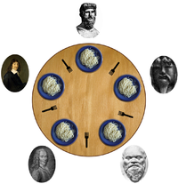

# Dining Philosophers Problem
## A solution written in C with multi-threading

### What is a Thread
A Thread is a light-weight process, they are not indeppendent from each other as a result they share thier code section with other threads, but like processes a thread has it's own programm counter, a register set, and a stack space. 
As written in [GeekforGeeks](https://www.geeksforgeeks.org/multithreading-c-2/)

### Waht is the "Dining Philosopher's" problem
There are x amount of Philosophers sitting at a round table. Everyone of them has a fork, but they need two Forks for eating. That means if on philosopher wants to eat they have to take the second fork right next to him. So if n'th philosopher eats then n+1 and n_x cant eat.



The goal is that every Philosopher has to eat somthing to be keept alive, if they dont eat something then they either are sleeping or thinking and they will die if they dont eat somthing over x amount time.

For more information -> [Subject](en.subject.pdf)

### How to Run
1.  clone git

2. make project
```
make
```
3. execute with
```
./philo <number_of_philos> <time_to_die> <time_to_eat> <time_to_sleep> [OPTIONAL]<meals_to_eat>
```

